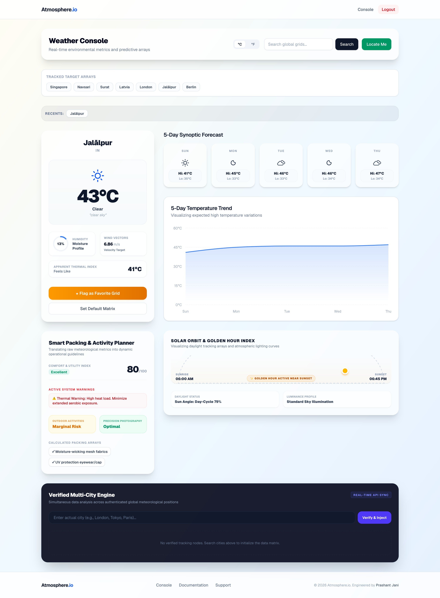

# Atmosphere.io | Premium Full-Stack Weather Analytics Console

Atmosphere.io is a modern, high-performance, full-stack weather intelligence application designed to deliver micro-climatic environmental matrices with zero interface lag. Built with a responsive, glassmorphic dark-mode dashboard framework, it aggregates live meteorological telemetry data and serves it through distinct, interactive visual arrays.

**Live Production Link:** [Atmosphere.io Live Console](https://atmosphere-io.onrender.com)

---

## 👁️ About The Project



Atmosphere.io approaches weather tracking through a data science lens—treating global atmospheric changes as real-time matrices that can be cross-examined, aggregated, and visualized dynamically. While standard consumer applications overload viewports with intrusive ads and clumsy user journeys, Atmosphere.io introduces a professional workstation layout.

The interface leverages glassmorphic styling, high-contrast atmospheric line/bar vectors, and context-dependent background wrappers that shift dynamically to echo physical meteorological states (fading into rich storm slates, deep night hues, or cold winter whites based on live data triggers). Registered users unlock advanced telemetry persistence layers, empowering them to anchor multiple cities into synchronized observation grids, manage automated apparel optimization profiles, and monitor solar arcs in real-time.

### Built With

This project leverages a modern and powerful set of technologies:

*   **Backend Infrastructure:**
    *   [Node.js](https://nodejs.org/) - Event-driven asynchronous runtime environment.
    *   [Express.js](https://expressjs.com/) - High-performance REST API routing framework running strict Express v5 pattern matching.
    *   [MongoDB Atlas](https://www.mongodb.com/) - Cloud distributed database managed via [Mongoose ORM schemas](https://mongoosejs.com/).
    *   [JSON Web Tokens (JWT)](https://jwt.io/) - State-agnostic asymmetric cryptography for session persistence.
    *   [Axios](https://axios-http.com/) - Upstream network adapter communicating directly with meteorological satellites.
*   **Frontend User Interface:**
    *   [React.js](https://reactjs.org/) - Declarative UI component engine utilizing React 18 functional layouts.
    *   [Vite](https://vitejs.dev/) - Light-speed frontend build automation and compiler.
    *   [Tailwind CSS](https://tailwindcss.com/) - Utility-first layout architecture driving fully custom glassmorphism.
    *   [Chart.js / Recharts](https://chartjs.org/) - Canvas rendering engine mapping dynamic humidity vectors and thermal curves.
    *   [React Router](https://reactrouter.com/) - Client-side virtual routing paths separating secure entry gates.

---

## 🛠️ System Architecture

+-------------------------------------------------------------+
|                      Client Browser UI                      |
|             (Virtual Routes via React Router DOM)           |
+------------------------------+------------------------------+
|
(HTTPS REST)
v
+-------------------------------------------------------------+
|                    Express API Gateway                      | <---> [ MongoDB Cloud Atlas ]
|              (Session Validation via JWT)                   |    (User Favorites / Profiles)
+------------------------------+------------------------------+
|
(Axios Proxy)
v
+-------------------------------------------------------------+
|                OpenWeatherMap Satellites                    |
+-------------------------------------------------------------+

---

## Features

*   **Real-Time Weather Search:** Search weather conditions for cities across the globe. Instant access to temperature, humidity, pressure, wind speed, visibility, and atmospheric conditions. Dynamic weather icons and condition summaries.
*   **5-Day Forecast Analytics:** Detailed multi-day weather forecasting. Daily temperature trends. Forecast summaries and environmental projections.
*   **Secure User Authentication:** Users can register for an account and log in securely. Passwords are encrypted and sessions are managed with JWT.
*   **Multi-City Weather Monitoring:** Save multiple favorite locations. Compare weather conditions between cities. Persistent city tracking stored in MongoDB.
*   **Interactive Data Visualization:** Temperature trend charts. Humidity analytics. Forecast visualization dashboards. Environmental metric tracking.
*   **Responsive Design:** A beautiful, consistent user experience across all devices, from mobile phones to desktops.
*   **Polished UI:** A professional and modern interface built with the Material-UI component library and a custom theme.

---

## Advanced Features Deep Dive

### 1. Zero-Mock Multi-City Analytics Engine (Authenticated Option)

The basic location lookup scale transforms into an advanced tracking matrix once a user registers or logs in.

*   **Active Boundary Verification:** Dropping an injection into your city cluster runs a live API route lookup on the backend to validate real-world global indexing coordinates. Random strings, dangerous characters, or incomplete inputs are safely caught and rejected at the server gateway before parsing.
*   **Telemetry Processing Matrix:** Evaluates your entire active synchronization grid on the fly to isolate mathematical thresholds, immediately highlighting the *Thermal Peak* (Maximum Temperature) and *Thermal Floor* (Minimum Temperature) across all your saved tracking cards at a glance.
*   **Data Serialization Engine:** Standard response templates are broken down, filtered, and serialized on the backend to separate multi-day nested weather lists into distinct array metrics for high-contrast chart rendering.

### 2. Solar Orbit & Golden Hour Index Tracker

Rather than parsing boring, static timestamp text rows for sunrise and sunset milestones, *Atmosphere.io* renders an interactive astronomical tracker.

*   **Sinusoidal Trajectory Mapping:** Calculates the sun's exact orbital position along an active sinusoidal curve derived from current real-time clock cycles relative to local city horizons.
*   **Ambient Lighting Indicators:** Computes real-time daylight proximity bounds to isolate target periods highlighting *Golden Hour* photography parameters or low-visibility twilight segments.

### 3. Contextual Atmospheric Background Adapters

*   The application processes returning meteorological condition identifiers (such as *Clear*, *Rain*, *Snow*, *Thunderstorm*, or *Clouds*) and seamlessly updates the root viewport styling wrapper. Fading transitions smoothly alter background color matrices and linear borders to reflect atmospheric reality, bringing the outdoor mood right into the user interface.

### 4. Smart Activity Apparel Planner (Authenticated Option)

*   Say goodbye to second-guessing outdoor workouts. A backend rule execution engine parses active wind vectors, precipitation density, and moisture percentages to output contextually accurate gear and apparel recommendations, aiding outdoor training prep.

### 5. Smart Authentication Gates & Conversion Anchors

To maximize user conversion and platform onboarding, the console implements a strategic premium access layout barrier:

*   **Guest Workspace:** Visitors enjoy immediate access to core location search results, historical data metrics tracking, and 5-day predictive forecasts.
*   **Premium Teaser Interface:** Protected features (Multi-City Engine, Apparel Planner, Solar Arc Tracker) degrade beautifully into glassmorphic placeholder cards highlighting locked functionality.
*   **Conversion Canvas:** A glowing, premium dark-neon container is exposed at the bottom viewport, educating guests on the benefits of cloud global synchronization preferences and inviting them to register or sign back into their workspace profiles.

---

## Getting Started

Follow these instructions to mirror the development environment and get a local copy running on your workstation:

### Prerequisites

You need to have the following software installed on your machine:
*   Node.js (which includes npm) - [https://nodejs.org/](https://nodejs.org/)
*   Git - [https://git-scm.com/](https://git-scm.com/)
*   A MongoDB Atlas account or a local MongoDB installation - [https://www.mongodb.com/atlas/database](https://www.mongodb.com/atlas/database)
* OpenWeatherMap API Token (Free Tier Key)

### Local Installation & Setup

1.  **Clone the repository:**
    ```sh
    git clone https://github.com/your-username/your-repo-name.git
    cd your-repo-name
    ```

2.  **Setup the Backend:**
    *   Navigate to the backend directory:
        ```sh
        cd backend
        ```
    *   Install the necessary NPM packages:
        ```sh
        npm install
        ```
    *   Create a `.env` file in the `backend` directory and add the following environment variables. Replace the placeholder values with your own.
        ```env
        PORT=5000
        MONGO_URI=your_mongodb_connection_string
        JWT_SECRET=your_super_secret_jwt_key
        ```
    *   Start the backend server:
        ```sh
        npm start
        ```
        The server will be running on `http://localhost:5000`.

3.  **Setup the Frontend:**
    *   Open a new terminal window and navigate to the frontend directory:
        ```sh
        cd frontend
        ```
    *   Install the necessary NPM packages:
        ```sh
        npm install
        ```
    *   Create a `.env.local` file in the `frontend` directory and add the following variable. This should point to your running backend server.
        ```env
        VITE_BACKEND_API_URL=http://localhost:5000
        ```
    *   Start the frontend development server:
        ```sh
        npm run dev
        ```
        The application will be available at `http://localhost:5173` (or another port if 5173 is in use).

---

## Contact

Prasant Jani - [jani.prasant2810@gmail.com](mailto:jani.prasant2810@gmail.com)

Project Link: [https://github.com/JaniPrasant/atmosphere-weather-dashboard](https://github.com/JaniPrasant/atmosphere-weather-dashboard)
